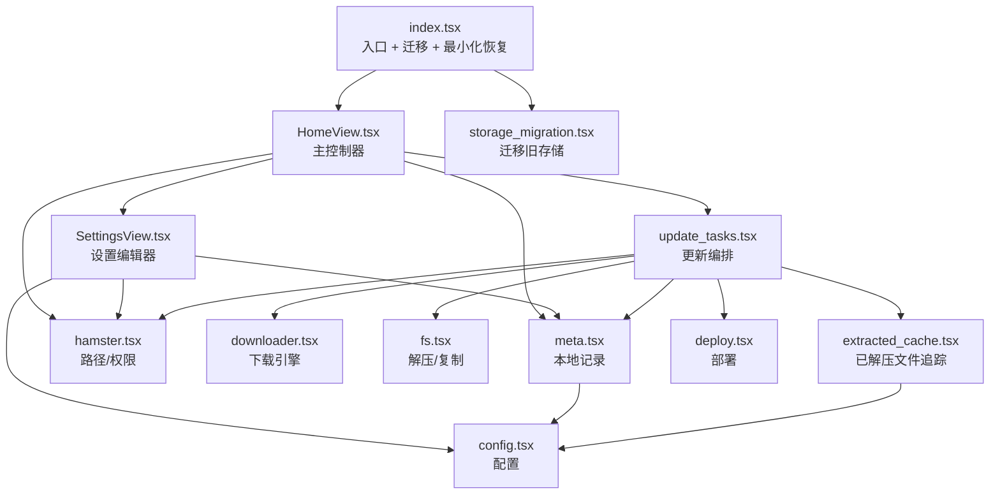

# 万象方案助手 — 最新项目代码分析

> 基于当前代码版本整理。重点面向“通过真实项目学习 TypeScript / JavaScript / Scripting 脚本架构”。
>
> 项目根目录：`/Users/zhangzhexiang/Documents/LocalScript/Scripting/scripts/万象方案助手`

---

## 1. 项目一句话概括

这是一个运行在 **Scripting iOS** 上的输入法资源更新脚本。它的职责不是“写输入法本身”，而是做一层完整的 **更新管理器**：

- 读取用户配置
- 解析书签路径并确认权限
- 从 GitHub / CNB 查远程资源
- 比较本地与远程版本
- 下载方案 / 词库 / 模型
- 解压、覆盖、删除旧文件
- 写回本地元数据缓存
- 最后按需调用输入法部署 URL Scheme

从软件工程角度看，它已经是一个很完整的“小型应用”，而不是单个脚本。

---

## 2. 当前代码规模

| 文件 | 行数 | 作用 |
|---|---:|---|
| `/Users/zhangzhexiang/Documents/LocalScript/Scripting/scripts/万象方案助手/index.tsx` | 45 | 脚本入口，处理最小化恢复与迁移 |
| `/Users/zhangzhexiang/Documents/LocalScript/Scripting/scripts/万象方案助手/widget.tsx` | 19 | 小组件入口 |
| `/Users/zhangzhexiang/Documents/LocalScript/Scripting/scripts/万象方案助手/script.json` | 46 | 脚本元信息 |
| `/Users/zhangzhexiang/Documents/LocalScript/Scripting/scripts/万象方案助手/components/HomeView.tsx` | 1385 | 主页面、日志、进度、检查/更新/部署主流程 |
| `/Users/zhangzhexiang/Documents/LocalScript/Scripting/scripts/万象方案助手/components/SettingsView.tsx` | 688 | 设置页、书签路径、配置保存、重置设置 |
| `/Users/zhangzhexiang/Documents/LocalScript/Scripting/scripts/万象方案助手/components/HomeSectionOrderView.tsx` | 111 | 首页区块排序页面 |
| `/Users/zhangzhexiang/Documents/LocalScript/Scripting/scripts/万象方案助手/utils/common.tsx` | 147 | 通用工具 |
| `/Users/zhangzhexiang/Documents/LocalScript/Scripting/scripts/万象方案助手/utils/config.tsx` | 117 | 配置类型、默认值、读写 |
| `/Users/zhangzhexiang/Documents/LocalScript/Scripting/scripts/万象方案助手/utils/runtime.tsx` | 8 | 运行时对象转发 |
| `/Users/zhangzhexiang/Documents/LocalScript/Scripting/scripts/万象方案助手/utils/update_tasks.tsx` | 888 | 核心更新编排 |
| `/Users/zhangzhexiang/Documents/LocalScript/Scripting/scripts/万象方案助手/utils/meta.tsx` | 529 | 本地元数据缓存 |
| `/Users/zhangzhexiang/Documents/LocalScript/Scripting/scripts/万象方案助手/utils/hamster.tsx` | 261 | 路径探测、书签解析、权限检测 |
| `/Users/zhangzhexiang/Documents/LocalScript/Scripting/scripts/万象方案助手/utils/downloader.tsx` | 562 | 下载器、进度、超时、重试 |
| `/Users/zhangzhexiang/Documents/LocalScript/Scripting/scripts/万象方案助手/utils/fs.tsx` | 376 | 解压、复制、目录整理 |
| `/Users/zhangzhexiang/Documents/LocalScript/Scripting/scripts/万象方案助手/utils/extracted_cache.tsx` | 218 | 记录上次解压出的文件列表 |
| `/Users/zhangzhexiang/Documents/LocalScript/Scripting/scripts/万象方案助手/utils/deploy.tsx` | 32 | 调起输入法部署 |
| `/Users/zhangzhexiang/Documents/LocalScript/Scripting/scripts/万象方案助手/utils/storage_migration.tsx` | 182 | 旧版 storage 迁移 |

**合计：5614 行**

这个规模意味着：你已经可以把它当成一个真实应用来读，而不是“几个函数拼起来的脚本”。

---

## 3. 和旧版分析相比，最重要的变化

旧版分析里最不准确的地方主要有三个：

1. **元数据结构已经简化**
   - 现在 `wanxiang_meta_store` 的核心结构是：
   ```ts
   {
     records: {
       [installRoot: string]: {
         scheme?,
         dict?,
         model?,
         predict?,
       }
     },
     bookmarks: {
       [bookmarkName: string]: installRoot
     }
   }
   ```
   - 旧版里提到的大量 `aliases` 归并逻辑，已经不再是当前主结构。

2. **HomeView 已经比旧版复杂很多**
   - 日志系统
   - 自动滚动
   - 全屏日志
   - Markdown 更新说明全屏
   - 首页区块排序
   - 检查结果缓存
   - 更复杂的操作区 UI

所以现在最合理的理解方式不是“几个页面 + 几个工具函数”，而是：

- `HomeView`：页面控制器 + UI 状态中心
- `SettingsView`：配置编辑器 + 路径切换同步器
- `update_tasks`：业务编排器
- `downloader / fs / meta / hamster`：基础设施层

---

## 4. 整体架构



### 你应该怎么理解这一层划分

- **UI 层**：`HomeView`、`SettingsView`、`HomeSectionOrderView`
- **业务层**：`update_tasks`
- **能力层**：`downloader`、`fs`、`hamster`、`meta`
- **配置与迁移层**：`config`、`storage_migration`

这是一种非常常见的前端/脚本项目结构：  
**页面负责交互，业务模块负责编排，基础模块负责干活。**

---

## 5. 脚本启动流程

文件：`/Users/zhangzhexiang/Documents/LocalScript/Scripting/scripts/万象方案助手/index.tsx`

关键代码：

```ts
async function run() {
  runStorageMigration()

  const removeResume =
    supportsMinimization && typeof Script.onResume === "function"
      ? Script.onResume(() => {
          void presentHome()
        })
      : () => {}

  await presentHome()

  if (!supportsMinimization) {
    removeResume()
  }
}
```

### 这里值得学习的点

#### 5.1 启动时先做迁移

`runStorageMigration()` 放在最前面，意味着：

- 先把旧数据结构整理成新结构
- 再让 UI 与业务逻辑读取

这是工程上很正确的顺序。否则 UI 代码里会混入大量“兼容旧结构”的判断。

#### 5.2 `presentHome()` 的幂等保护

```ts
let isPresentingHome = false
```

这是一种很常见的“重入保护”。

作用：

- 避免脚本恢复时重复 present 页面
- 防止最小化恢复回调和首次启动同时触发两次主页

这是学习异步 UI 时很值得注意的点：  
**只要有异步 present / push / modal，就要考虑重复触发。**

---

## 6. 配置系统：`config.tsx`

文件：`/Users/zhangzhexiang/Documents/LocalScript/Scripting/scripts/万象方案助手/utils/config.tsx`

核心类型：

```ts
export type AppConfig = {
  hamsterRootPath: string
  hamsterBookmarkName: string
  releaseSource: "cnb" | "github"
  githubToken: string
  schemeEdition: "base" | "pro"
  proSchemeKey: ProSchemeKey
  usePrereleaseScheme: boolean
  excludePatternsText: string
  autoDeployAfterDownload: boolean
  inputMethod: "hamster" | "hamster3"
  autoCheckOnLaunch: boolean
  showVerboseLog: boolean
  skipBuildCleanup: boolean
  homeSectionOrder: HomeSectionKey[]
}
```

### 这里值得重点学习

#### 6.1 TypeScript 的“配置对象建模”

这是一个非常典型的 TS 用法：

- 用 `type AppConfig` 集中定义配置结构
- 所有页面、工具函数都依赖这个类型

好处：

- 新增配置项时，编译器会提醒所有遗漏的地方
- 不容易出现“某个页面写的是字符串，另一个页面读的是布尔值”

#### 6.2 `DEFAULT_CONFIG` 是“单一真相来源”

```ts
export const DEFAULT_CONFIG: AppConfig = { ... }
```

这意味着默认值只维护一份。

后面这些场景都会依赖它：

- 首次启动
- storage 读取失败
- 重置设置
- 旧版配置缺字段时补齐默认值

#### 6.3 `loadConfig()` 的容错式解析

`loadConfig()` 不是简单 `JSON.parse`，而是做了：

- 读取当前 key
- 回退旧 key
- 修正旧枚举值（如 `cang/yuanshu`）
- 规范化 `homeSectionOrder`
- 与 `DEFAULT_CONFIG` 合并

这就是典型的“读取不可信数据”的方式。  
**只要数据来自 storage / 文件 / 网络，就不要假设它完全可信。**

---

## 7. 路径与权限系统：`hamster.tsx`

文件：`/Users/zhangzhexiang/Documents/LocalScript/Scripting/scripts/万象方案助手/utils/hamster.tsx`

这是整个项目最关键的“环境适配层”之一。

### 7.1 为什么它重要

这个脚本最麻烦的地方不是下载，而是：

- iOS 沙盒路径会变
- 书签权限会丢
- 仓输入法和元书输入法目录结构不同
- 路径可能有 `/private` 前缀，也可能没有

所以它必须把“用户选择的路径”转成“当前可写的实际安装目录”。

### 7.2 关键函数

#### `resolveBookmarkPath()`  
位置：`/Users/zhangzhexiang/Documents/LocalScript/Scripting/scripts/万象方案助手/utils/hamster.tsx:93`

作用：

- 先按书签名通过 `bookmarkedPath(name)` 解析
- 如果失败，再尝试从 `getAllFileBookmarks()` 里找
- 如果“用户设置了书签名，但解析失败”，就直接返回空字符串

这一条非常重要：

```ts
if (name) return ""
```

这代表作者明确选择了“宁可失败，也不信任旧路径字符串”。  
这是修复“重启后旧路径还能读到字符串，但其实已失效”的核心。

#### `detectRimeDir()`  
位置：`.../utils/hamster.tsx:135`

这是“根据书签目录判断真实安装目录”的入口。

逻辑大致是：

1. 先解析书签路径
2. 扫描 `RimeUserData/*`
3. 如果存在子目录，优先选 `wanxiang`
4. 否则尝试仓输入法路径：
   - `/RIME/Rime`
   - `/Rime`
5. 都没有就退回根路径

这是典型的“多候选路径探测”。

#### `verifyInstallPathAccess()`  
位置：`.../utils/hamster.tsx:233`

它不是只检查“目录存在”，而是：

- 解析实际安装路径
- 创建一个临时目录
- 再删除这个临时目录

这其实是在验证“读 + 写 + 删”三种权限，而不是只验证“看得见”。

这个思路很工程化。因为很多时候：

- `exists(path)` 成功
- 但真正写入仍然失败

---

## 8. 本地版本记录：`meta.tsx`

文件：`/Users/zhangzhexiang/Documents/LocalScript/Scripting/scripts/万象方案助手/utils/meta.tsx`

### 8.1 当前真实结构

```ts
type MetaStoreData = {
  records: Record<string, {
    scheme?: RecordData
    dict?: RecordData
    model?: RecordData
    predict?: RecordData
  }>
  bookmarks: Record<string, string>
}
```

含义：

- `records[path]`：这个安装目录下的本地记录
- `bookmarks[name]`：这个书签名当前指向哪个安装目录

### 8.2 为什么这比旧版更合理

旧思路的问题是“路径变体太多”，一旦用 `aliases` 大量归并，很容易：

- 切换路径后读错记录
- 旧 `/private` 路径与新路径互相污染

当前结构的核心思想是：

- **写入时只认当前 installRoot**
- **读取时优先精确命中**
- **书签只负责从名称映射到路径**

这是更稳定的策略。

### 8.3 值得重点读的函数

#### `readRecord()`  
位置：`.../utils/meta.tsx:181`

逻辑很简单但很关键：

1. 如果传入了 `installRoot`
   - 先按路径精确匹配
   - 命中后顺手更新书签绑定
2. 否则如果只有 `bookmarkName`
   - 先用 `bookmarks[name]` 找路径
   - 再按路径读取

它的核心是：

- **优先路径**
- **书签只是辅助索引**

#### `writeRecord()`  
位置：`.../utils/meta.tsx:202`

这个函数最值得学习的点是“只覆盖当前 kind，但保留同一路径下其他 kind”。

比如更新模型时：

- 覆盖 `model`
- 保留已有 `scheme / dict`

这就是为什么本地信息不会因为一次局部更新而丢掉其他项。

### 8.4 类型转换层也很重要

下面这些函数：

- `toSchemeMeta()`
- `toDictMeta()`
- `toModelMeta()`
- `toPredictMeta()`

本质上是在做：

**Storage 原始结构 -> UI / 业务层更易用的领域对象**

这是很标准的“DTO 转领域对象”的模式。

---

## 9. 旧文件删除记录：`extracted_cache.tsx`

文件：`/Users/zhangzhexiang/Documents/LocalScript/Scripting/scripts/万象方案助手/utils/extracted_cache.tsx`

### 9.1 这个模块解决了什么问题

如果你只会“解压覆盖”，通常会遇到两个问题：

1. zip 里已经删掉的旧文件不会自动消失
2. 用户排除文件时，删除逻辑和写入逻辑容易不一致

所以这里单独记录了“上一次解压实际写入了哪些文件”。

### 9.2 核心思路

```ts
type StoreData = {
  [installRoot: string]: {
    scheme?: { files: string[] }
    dict?: { files: string[] }
  }
}
```

更新流程变成：

1. 解压时记录写入了哪些文件
2. 下次更新前先读这个记录
3. 先删旧文件，再解压新文件

### 9.3 `removeExtractedFiles()` 很值得看

位置：`.../utils/extracted_cache.tsx:150`

这个函数里面有几层很典型的工程保护：

- 命中排除规则就跳过
- 文件不存在就跳过
- 删除成功后尝试清理空父目录
- 如果父目录内容无法读取，则保守地不删目录

其中这句注释很关键：

```ts
// 保守处理：无法判断目录内容时不做目录删除，避免误删排除文件
```

这体现了一个很重要的工程思想：  
**遇到不确定状态时，宁可少删，也不要误删。**

---

## 10. 文件操作与解压：`fs.tsx`

文件：`/Users/zhangzhexiang/Documents/LocalScript/Scripting/scripts/万象方案助手/utils/fs.tsx`

### 10.1 为什么要单独封装

Scripting 的 `FileManager` API 并不完全稳定，不同环境可用方法可能不同。

所以这里做了大量兼容：

- `readDirectory / readDirectorySync / listContents / list`
- `copyFile / copy / copyItem`
- `remove / delete / removeItem`

这就是一个典型的“适配器层”。

### 10.2 最重要的函数：`unzipToDirWithOverwrite()`

位置：`.../utils/fs.tsx:191`

它做的事远不只是“解压”：

1. 解压到临时目录
2. 过滤掉 `__MACOSX`、`.DS_Store`
3. 支持 `flattenSingleDir`
4. 支持排除规则
5. 复制到目标目录时先删除同名旧文件
6. 支持进度回调
7. 最后删除临时目录

#### `flattenSingleDir`

这是为词库 zip 特别准备的能力。

有些词库包解压后是：

```text
dicts/pro-moqi-fuzhu-dicts/chengyu.txt
```

但脚本真正想要的是：

```text
dicts/chengyu.txt
```

所以这个参数就是“自动下钻一层目录再复制”。

### 10.3 `mergeSubdirsByName()`

位置：`.../utils/fs.tsx:316`

这是自动更新后额外做的一次“善后整理”：

- 扫描 `dicts` 下仍然残留的 `*dict*` 目录
- 把里面文件再 merge 到 `dicts`
- 只有在确认不包含排除文件时才删除这个目录

这个逻辑存在的原因是：  
**不同来源的压缩包结构并不统一，不能指望 zip 永远长得一样。**

---

## 11. 下载器：`downloader.tsx`

文件：`/Users/zhangzhexiang/Documents/LocalScript/Scripting/scripts/万象方案助手/utils/downloader.tsx`

这是另一个非常值得系统学习的模块。

### 11.1 它解决的不是“下载文件”，而是“稳定下载大文件”

尤其是模型 `.gram` 这类大文件。

### 11.2 两套下载路径

#### 主路径：后台下载

`downloadWithProgress()` -> `BackgroundURLSession.startDownload(...)`

优点：

- 直接落盘
- 不需要把整个大文件放进 JS 内存
- 更适合 iOS

#### 兜底路径：fetch

`downloadWithFetchFallback()`

但这里不是简单 `await res.arrayBuffer()`，它优先尝试：

```ts
fm.appendData(...)
```

即边读边写，避免大文件占满内存。

这是这类项目里最值得学习的点之一。

### 11.3 进度为什么不会乱跳

核心在 `makeCumulativeEmitter()`。

这个函数做了几件很重要的事：

- `received` 只增不减
- `total` 只接受更大的值，不接受变小
- `percent` 单调递增，不回退
- 节流后再发给 UI

这正是“进度条数字乱跳”问题的标准修法。

### 11.4 超时与重试

关键常量：

- `STALL_TIMEOUT_MS = 2 分钟`
- `HARD_TIMEOUT_MS = 5 分钟`
- `MAX_RETRY = 1`

含义：

- 长时间无进度变化 -> 视为卡住
- 先重试一次
- 仍失败则抛错终止任务

这就是你之前反复遇到的“模型下载卡住”的主要防线。

---

## 12. 业务核心：`update_tasks.tsx`

文件：`/Users/zhangzhexiang/Documents/LocalScript/Scripting/scripts/万象方案助手/utils/update_tasks.tsx`

这是整个项目最核心的业务编排器。

### 12.1 它负责什么

- 查远程 release
- 判断资源名模式
- 检查所有更新
- 分别更新方案 / 词库 / 模型
- 自动更新全流程编排
- 部署前清理 `build`

### 12.2 资源类型

```ts
type AllUpdateResult = {
  scheme?: RemoteAsset
  dict?: RemoteAsset
  model?: RemoteAsset
}
```

这一层是非常典型的 TS 建模：

- 把“远程资产”抽成统一结构
- 上层 UI 就能用统一方式读它们

### 12.3 远程查询函数

#### `fetchLatestAssetFromGithub()`  
位置：`.../utils/update_tasks.tsx:126`

特点：

- 直接走 GitHub Releases API
- 支持 `tag` / `assetNameExact` / `assetNameGlob`
- 支持 token
- 会尽量取出 `digest` 里的 sha256

#### `fetchLatestAssetFromCnb()`  
位置：`.../utils/update_tasks.tsx:170`

CNB 逻辑比 GitHub 复杂，因为：

- 返回格式不完全统一
- 方案、词库、模型的 release tag 规则不同
- 模型位置不稳定，所以要分页遍历

当前代码里的策略是：

- `CNB` 正式版方案：保持原来的方案 release 逻辑
- `CNB` 预发布方案：按 tag `v1.0.0` 查找
- `CNB` 词库：按 tag `v1.0.0` 查找
- `CNB` 模型：按 tag `model`，并遍历所有分页直到找到目标资产

这说明接口本身并没有一个统一的“固定单点入口”，业务层需要按资源类型补不同策略。

#### `httpJson()` 里的超时控制为什么用了 `globalThis.AbortController`

在远程请求这一层，还有一个很小但很典型的修复：

```ts
const AbortControllerCtor = (globalThis as any).AbortController
const controller = typeof AbortControllerCtor === "function" ? new AbortControllerCtor() : null
```

这里没有直接写：

```ts
new AbortController()
```

原因不是逻辑问题，而是类型环境问题：

- 当前 Scripting 的类型声明里，不一定声明了全局 `AbortController`
- 但运行时可能又确实提供了它

所以这里采用了更稳的写法：

- 先从 `globalThis` 取构造器
- 再做运行时判断

这值得学习，因为它体现的是：

- 类型系统和运行时能力不完全一致时
- 可以用“运行时探测”来兼容

这类写法在脚本环境、混合运行时环境里非常常见。

### 12.4 `checkAllUpdates()`

位置：`.../utils/update_tasks.tsx:306`

它统一检查：

- 方案
- 词库
- 模型

注意这里“检查更新”不做版本比较，它只是拿远程资产。  
真正的“是否需要更新”是在 `HomeView.buildUpdateDecision()` 和 `autoUpdateAll()` 里做的。

这是一个值得学习的职责分离：

- `checkAllUpdates()`：**拿数据**
- `buildUpdateDecision()`：**做判断**

### 12.5 `updateScheme()`

位置：`.../utils/update_tasks.tsx:377`

完整流程：

1. 检测目录与输入法
2. 获取远程方案资产
3. 下载 zip
4. 校验文件大小
5. 删除旧方案文件
6. 解压覆盖
7. 记录新的解压文件列表
8. 写入 `scheme` 元数据
9. 按需部署

这个函数是理解整个项目的最佳入口之一。

### 12.6 `updateDict()`

位置：`.../utils/update_tasks.tsx:484`

和方案的区别：

- 目标目录固定是 `dicts`
- 解压时 `flattenSingleDir: true`
- 解压后还会 `mergeSubdirsByName(...)`

这就是为什么词库逻辑会比方案多一层“整理目录”。

### 12.7 `updateModel()`

位置：`.../utils/update_tasks.tsx:716`

当前它就是单独更新模型文件。

```ts
targets?: {
  model?: boolean
  predict?: boolean
}
```

这让它可以同时满足两种场景：

- 手动点击按钮：强制重新下载
- 自动更新：只更新真正需要更新的项

### 12.9 `autoUpdateAll()`

位置：`.../utils/update_tasks.tsx:791`

自动更新的核心思想是：

1. 先拿远程信息
2. 读取本地 meta
3. 判断四项是否需要更新
4. 按需执行 `updateScheme / updateDict / updateModel`
5. 最后统一部署一次

这里“最后统一部署一次”是很重要的设计：

- 避免每更新一个东西就部署一次
- 这才符合输入法更新的实际体验

---

## 13. 主页面：`HomeView.tsx`

文件：`/Users/zhangzhexiang/Documents/LocalScript/Scripting/scripts/万象方案助手/components/HomeView.tsx`

这是当前项目最复杂的文件。

你可以把它理解为：

- 页面组件
- 状态机
- UI 协调器
- 检查结果缓存容器
- 日志系统入口

### 13.1 为什么它很大

因为它同时承担了：

- 本地信息显示
- 远程信息显示
- 更新说明
- 日志
- 进度条
- 操作按钮
- 设置跳转
- 文本编辑器跳转
- 最小化恢复后的状态保持

所以它不是“纯 UI”，而是页面控制器。

### 13.2 关键数据结构

#### `HomeSessionState`

位置：`.../components/HomeView.tsx:197`

```ts
type HomeSessionState = {
  remoteSchemeVer: string
  remoteDictMark: string
  remoteModelMark: string
  remotePredictMark: string
  notes: string
  lastCheck: AllUpdateResult | null
  lastCheckDecision: UpdateDecision | null
  lastCheckKey: string
  logs: LogEntry[]
}
```

它存在的意义是：

- 页面关闭/恢复时保留远程信息和日志
- 避免一切都只依赖 React 状态

这是一种“页面级会话缓存”的写法。

#### `UpdateDecision`

位置：`.../components/HomeView.tsx:190`

```ts
type UpdateDecision = {
  scheme: boolean
  dict: boolean
  model: boolean
  predict: boolean
}
```

这就是“是否需要更新”的统一结果。

有了这层抽象，后面很多 UI 和自动更新逻辑都能统一处理。

### 13.3 最值得读的几个函数

#### `buildUpdateDecision()`

位置：`.../components/HomeView.tsx:263`

这个函数把“远程资源”和“本地 meta”做比较，最终产出布尔结果。

重点不是算法复杂，而是设计很清晰：

- 先把版本标识规范化 `normalizeMark()`
- 再按类型一项项比较

这正是“判断逻辑集中化”的好例子。

#### `pushLog()`

位置：`.../components/HomeView.tsx:567`

它做了：

- 替换路径前缀，避免日志里全是超长绝对路径
- 自动加 emoji
- 限制日志最多 200 条
- 同步写入 `homeSessionState.logs`

这种“统一入口写日志”的方式非常重要。  
只要项目有日志，就尽量不要到处 `setLogs([...])`。

#### `onCheckUpdate()`

这是主页中最关键的用户动作之一。

它做的事包括：

- 先做路径权限校验
- 刷新本地信息
- 重新读取最新配置
- 调 `checkAllUpdates()`
- 更新远程信息区
- 写入检查结果缓存
- 生成详细日志

这里有一个设计点很值得学：  
**它在真正请求前，会先 `refreshLocal(current)`，再重新 `loadConfig()`。**

原因是路径切换后，设置页可能根据本地记录自动同步方案/源/输入法/预发布方案开关。  
如果不重新读取配置，这次检查就可能还是用旧配置。

#### `onAutoUpdate()`

这是把很多工程细节串起来的地方：

- 若已有有效检查结果，直接复用
- 若没有，就先检查再更新
- 如果全是最新，直接结束，不部署
- 否则调 `autoUpdateAll()`
- 更新完成后刷新本地信息

这体现的是：  
**“检查”和“更新”虽然是两个动作，但要共享判定结果。**

最近这个流程还有一个重要修复点：

- 更新完成后不能继续沿用“更新前”的 `lastCheckDecision`
- 否则首页本地信息虽然已经变成最新，但自动更新按钮仍然是绿色
- 再点一次自动更新，就会继续按旧判定重复下载

当前实现的正确逻辑是：

- 更新完成后重新读取本地 `meta`
- 用最近一次远程检查结果重新计算 `UpdateDecision`
- 如果本地已经追平远程版本，就把自动更新按钮恢复为蓝色

因此这里实际上是两层状态同步：

1. `refreshLocal(current)`：刷新首页显示的本地信息
2. `refreshLastCheckDecision(current, remote)`：刷新“是否还有可用更新”的判定

### 13.4 日志 UI 值得学习什么

#### `LogEntryRow`

位置：`.../components/HomeView.tsx:313`

这里做了几件 UI 上很细的事情：

- 时间、级别、作用域分别着色
- 如果消息末尾是“可更新”，最后三个字单独高亮绿色
- 支持复制

这说明组件已经不是简单输出字符串，而是在做“结构化日志渲染”。

#### 全屏日志 / 全屏更新说明

位置：

- `FullscreenLogView()`：`.../components/HomeView.tsx:373`
- `FullscreenNotesView()`：`.../components/HomeView.tsx:450`

都用了“先打开页面，再异步填充内容”的策略：

```ts
setVisibleLogs(null)
const timer = setTimeout(() => {
  setVisibleLogs(props.logs)
}, 80)
```

这是为了解决“内容太多，点开全屏时卡一下”的问题。

这是一个非常实用的 UI 优化技巧。

### 13.5 操作区为什么值得看

当前操作区按钮并不只是 UI，它还体现了：

- `checkKey(cfg)` 用来判断检查结果是否仍然匹配当前配置
- 自动更新按钮在有可用更新时会变绿
- 更新完成并重算判定后，会恢复为蓝色
- 方案 / 词库 / 模型按钮也会根据检查结果单独变绿

这类“UI 显示依赖真实业务状态”的写法，是真实项目里很常见的。

#### 最近这次按钮样式优化，为什么值得记录

这次没有改操作区布局：

- 仍然是两行三列
- 按钮尺寸不变
- 区域大小不变

只改了按钮本身的视觉壳子，也就是 `GridButton()` 的实现。

改法参考了桌面模板脚本：

- `/Users/zhangzhexiang/Desktop/ActionTileButton.tsx`

核心思路是：

- 保留原有功能和尺寸
- 把原来较“平”的按钮，替换成独立圆角卡片

现在 `GridButton()` 的视觉规则是：

- `buttonStyle="plain"`
- 浅色模式：
  - `secondarySystemBackground`
  - `cornerRadius: 16`
- 深色模式：
  - `RoundedRectangle`
  - 深灰背景
  - `separator` 描边

这类调整很适合学习，因为它说明：

- UI 优化不一定非要改布局
- 有时只换“组件皮肤”，就能明显提升观感

这也是一个很典型的工程策略：

- 先锁定交互和尺寸不动
- 再局部替换视觉实现

这样风险最小。

---

## 14. 设置页：`SettingsView.tsx`

文件：`/Users/zhangzhexiang/Documents/LocalScript/Scripting/scripts/万象方案助手/components/SettingsView.tsx`

这个页面本质上不是“静态表单”，而是一个会根据路径缓存动态回填内容的编辑器。

当前版本里，`SettingsView` 已经收敛成 **tab 内嵌设置内容页**，不再承担“独立弹出设置页 + 自带右上角文本保存按钮”的旧职责。

保存动作现在由主页里的设置 tab 右上角 SF Symbol 按钮触发，`SettingsView` 本身只负责：

- 渲染设置表单
- 注册保存回调
- 执行真正的保存逻辑
- 接收左上角关闭 / 最小化工具栏
- 接收右上角保存按钮注入

### 14.1 当前设置项

- Hamster 路径 / 书签文件夹
- 发布源
- 预发布版本
- GitHub Token
- 方案（base / pro）
- Pro 辅助码
- 输入法
- 自动检查更新
- 显示详细日志
- 不清理部署目录(build)
- 首页区块排序
- 排除文件规则
- 清理缓存
- 重置设置

### 14.2 最值得读的函数

#### `syncSchemeFromLocal()`

位置：`.../components/SettingsView.tsx:213`

这个函数虽然名字叫 `syncSchemeFromLocal`，但现在它实际上会同步四类信息：

- 方案
- 发布源
- 输入法
- 预发布方案开关

它做法是：

1. 先 `detectRimeDir()`
2. 收集候选路径
3. 用 `loadMetaAsync()` 读本地记录
4. 把记录回填到当前设置表单

这个函数很适合学习“表单状态与本地缓存联动”。

#### `refreshBookmarks()`

位置：`.../components/SettingsView.tsx:282`

它不是简单读取书签列表，还会：

- 计算当前配置对应哪个书签
- 解析该书签的真实路径
- 如果路径切换了，则进一步调用 `syncSchemeFromLocal(...)`

换句话说，它承担的是：

**书签列表刷新 + 当前选中项定位 + 路径切换后的联动同步**

#### `saveAndClose()`

位置：`.../components/SettingsView.tsx:343`

这是设置页最值得完整读一遍的函数。

它处理了几个复杂分支：

1. 路径是否变化
2. 方案是否变化
3. 路径变化时是否需要先按本地记录回填配置

当前版本还要注意一个结构变化：

- 设置页不再自己决定“保存后 dismiss”
- 它只负责执行保存，然后通过 `onDone` 把新配置回传给主页
- 主页 tab 容器再决定后续 UI 刷新

除此之外，当前设置页还有两个与运维相关的动作：

- `清理缓存`：只删除临时下载文件 `wanxiang_tmp_*`
- `重置设置`：清空本地设置和缓存记录

#### `resetSettings()`

位置：`.../components/SettingsView.tsx:392`

它会清理三个 storage key：

- `wanxiang_updater_config`
- `wanxiang_meta_store`
- `wanxiang_extracted_files`

这很适合学习“重置操作不只是改 UI，而是要回到真实存储层”。

---

## 15. storage 迁移：`storage_migration.tsx`

文件：`/Users/zhangzhexiang/Documents/LocalScript/Scripting/scripts/万象方案助手/utils/storage_migration.tsx`

### 15.1 它解决的问题

项目迭代过程中，storage 结构改过多次：

- 配置 key 改名
- meta 结构改变
- extracted file 结构改变

所以脚本启动时会统一做一次迁移，避免后面每个模块都兼容旧格式。

### 15.2 重点函数

#### `cleanupMetaStore()`

位置：`.../utils/storage_migration.tsx:101`

它会做三件事：

1. 把旧 records 统一整理成当前结构
2. 处理 `/private` 与非 `/private` 路径的合并
3. 重新生成 bookmarks 到 canonical path 的映射

这是典型的“启动期数据修复逻辑”。

---

## 16. 这个项目里值得重点学习的 TypeScript / JavaScript 知识点

下面是最值得拿来学习的语言层内容。

### 16.1 联合类型与字面量类型

例如：

```ts
type ReleaseSource = "cnb" | "github"
type InputMethod = "hamster" | "hamster3"
type LogLevel = "INFO" | "WARN" | "ERROR" | "SUCCESS"
```

这类写法的优点：

- 限制取值范围
- 让条件分支更清楚
- 编译器能帮你发现漏写分支

### 16.2 “领域对象类型”与“存储对象类型”分离

在 `meta.tsx` 里同时存在：

- `RecordData`：storage 原始格式
- `SchemeMeta / DictMeta / ModelMeta / PredictMeta`：业务层格式

这是很好的建模习惯。  
不要把 storage 里怎么存，直接暴露给 UI。

### 16.3 参数对象模式

比如：

```ts
export async function updateDict(
  cfg: AppConfig,
  params: {
    onStage?: (s: string) => void
    onLog?: (s: string) => void
    onProgress?: (...)
    autoDeploy?: boolean
  }
)
```

为什么要这样写，而不是一长串参数？

- 可读性更高
- 扩展参数时不容易破坏旧调用
- 调用点更自解释

### 16.4 兼容式 API 调用

项目里大量出现：

```ts
if (typeof fm.readDirectory === "function") ...
else if (typeof fm.readDirectorySync === "function") ...
```

这就是在做“运行时能力探测”。

在不完全稳定的平台 API 上，这是非常常见的技巧。

### 16.5 `useState + useEffect + storage/session` 混合状态管理

这个项目不是纯 React 状态，也不是纯 storage，而是三层：

- `useState`：当前页面渲染状态
- `homeSessionState`：页面生命周期之外的会话状态
- `Storage`：持久化状态

这非常接近真实前端项目里的：

- 组件状态
- 全局状态
- 持久化状态

---

## 17. 建议你按什么顺序阅读源码

如果目的是学习，我建议按下面顺序。

### 第一轮：先看“整体是怎么跑起来的”

1. `/Users/zhangzhexiang/Documents/LocalScript/Scripting/scripts/万象方案助手/index.tsx`
2. `/Users/zhangzhexiang/Documents/LocalScript/Scripting/scripts/万象方案助手/utils/config.tsx`
3. `/Users/zhangzhexiang/Documents/LocalScript/Scripting/scripts/万象方案助手/components/HomeView.tsx`

目标：

- 知道入口在哪
- 知道配置长什么样
- 知道主页都能做什么

### 第二轮：看“核心业务怎么更新”

1. `/Users/zhangzhexiang/Documents/LocalScript/Scripting/scripts/万象方案助手/utils/update_tasks.tsx`
2. `/Users/zhangzhexiang/Documents/LocalScript/Scripting/scripts/万象方案助手/utils/downloader.tsx`
3. `/Users/zhangzhexiang/Documents/LocalScript/Scripting/scripts/万象方案助手/utils/fs.tsx`

目标：

- 理解资源怎么查
- 文件怎么下
- zip 怎么解

### 第三轮：看“状态怎么落地”

1. `/Users/zhangzhexiang/Documents/LocalScript/Scripting/scripts/万象方案助手/utils/meta.tsx`
2. `/Users/zhangzhexiang/Documents/LocalScript/Scripting/scripts/万象方案助手/utils/extracted_cache.tsx`
3. `/Users/zhangzhexiang/Documents/LocalScript/Scripting/scripts/万象方案助手/utils/storage_migration.tsx`

目标：

- 理解本地记录怎么保存
- 理解为什么下次更新前能删旧文件
- 理解旧数据如何迁移

### 第四轮：再看设置页联动

1. `/Users/zhangzhexiang/Documents/LocalScript/Scripting/scripts/万象方案助手/components/SettingsView.tsx`
2. `/Users/zhangzhexiang/Documents/LocalScript/Scripting/scripts/万象方案助手/utils/hamster.tsx`

目标：

- 理解路径切换为什么能带动方案/源/输入法/预发布方案开关切换

---

## 18. 当前版本最值得精读的代码段

如果只挑几个地方精读，我建议这几个：

### A. `HomeView.buildUpdateDecision()`

为什么看：

- 学“比较逻辑集中化”
- 学“UI 不直接比较业务数据”

位置：`/Users/zhangzhexiang/Documents/LocalScript/Scripting/scripts/万象方案助手/components/HomeView.tsx:263`

### B. `SettingsView.syncSchemeFromLocal()`

为什么看：

- 学“路径切换 -> 本地缓存 -> 表单状态”的联动

位置：`/Users/zhangzhexiang/Documents/LocalScript/Scripting/scripts/万象方案助手/components/SettingsView.tsx:213`

### C. `update_tasks.updateDict()`

为什么看：

- 是最能体现“下载 + 清理 + 解压 + 整理 + 写记录”的完整流程

位置：`/Users/zhangzhexiang/Documents/LocalScript/Scripting/scripts/万象方案助手/utils/update_tasks.tsx:484`

### D. `downloader.makeCumulativeEmitter()`

为什么看：

- 学“进度条不回跳”的处理方式

位置：`/Users/zhangzhexiang/Documents/LocalScript/Scripting/scripts/万象方案助手/utils/downloader.tsx:270`

### E. `meta.writeRecord()`

为什么看：

- 学“同一路径下多种记录合并写入”

位置：`/Users/zhangzhexiang/Documents/LocalScript/Scripting/scripts/万象方案助手/utils/meta.tsx:202`

### F. `fs.unzipToDirWithOverwrite()`

为什么看：

- 学“临时目录 + 解压 + 过滤 + 覆盖写入”的标准做法

位置：`/Users/zhangzhexiang/Documents/LocalScript/Scripting/scripts/万象方案助手/utils/fs.tsx:191`

---

## 19. 你现在可以从这个项目学到什么

如果你是为了学 TypeScript / JavaScript，这个项目最适合学的不是语法本身，而是这些能力：

- 如何把一个脚本拆成多层模块
- 如何定义清晰的数据结构
- 如何在 UI、业务、存储之间分层
- 如何处理真实世界里的不稳定 API
- 如何处理路径、权限、缓存、迁移、重试、超时
- 如何让“用户点按钮”最终变成一个稳定的异步流程

从学习价值看，这个项目已经覆盖了很多真实工程问题。

---

## 20. 后续如果继续深入，我建议你这样学

下一步最有效的学习方式不是继续看整份文档，而是“对着源码做专题”：

1. **专题一：配置系统**
   - 只读 `config.tsx + SettingsView.tsx`
2. **专题二：本地记录系统**
   - 只读 `meta.tsx + storage_migration.tsx`
3. **专题三：下载与进度**
   - 只读 `downloader.tsx + HomeView.tsx`
4. **专题四：解压与旧文件删除**
   - 只读 `fs.tsx + extracted_cache.tsx + update_tasks.tsx`

这样比一次性读完整个项目更容易真正吃透。

---

## 21. 总结

当前版本的万象方案助手脚本，可以概括成：

- **UI 上**：已经是完整的小型应用
- **业务上**：有清晰的更新编排中心
- **工程上**：有路径适配、下载兜底、迁移、缓存、重置等完整能力
- **学习上**：非常适合拿来学“真实项目中的 TypeScript / JavaScript”

如果你后面需要，我可以继续基于这份文档，给你再拆一版：

- “只讲 HomeView 的源码讲解版”
- “只讲 update_tasks 的源码讲解版”
- “只讲 TypeScript 类型设计的讲解版”

---

## 22. 这个项目里高频出现的 TypeScript / JavaScript 语法详解

这一节不讲“业务”，只讲“代码是怎么写的”。

---

### 22.1 类型别名 `type`

示例：

```ts
export type ReleaseSource = "cnb" | "github"
export type InputMethod = "hamster" | "hamster3"
```

说明：

- `type` 用来定义一个类型名字
- 右边可以是：
  - 字面量联合类型
  - 对象类型
  - 函数类型
  - 其他类型组合

在这个项目里，`type` 的使用非常多，主要是为了：

- 限制配置项取值
- 明确函数参数结构
- 让编辑器自动提示更强

你可以把它理解成：  
**给“数据长什么样”起名字。**

---

### 22.2 字面量联合类型

示例：

```ts
type LogLevel = "INFO" | "WARN" | "ERROR" | "SUCCESS"
```

这表示：

- 变量不能随便是任意字符串
- 只能是这四个值中的一个

好处：

- 少写错
- `if` / `switch` 分支更清楚
- 代码语义更强

这是 TypeScript 比纯 JavaScript 非常有价值的地方。

---

### 22.3 对象类型

示例：

```ts
export type AppConfig = {
  hamsterRootPath: string
  hamsterBookmarkName: string
  releaseSource: ReleaseSource
  githubToken: string
  ...
}
```

这表示一个对象必须具有这些字段。

这里值得注意的点：

- 字段名后面用 `:` 指定类型
- 整个对象结构被固定下来
- 之后所有函数只要声明参数类型是 `AppConfig`，就共享同一套规则

这就是“配置建模”。

---

### 22.4 可选属性 `?`

示例：

```ts
type RemoteAsset = {
  name: string
  url: string
  tag?: string
  body?: string
}
```

含义：

- `name` 和 `url` 必须有
- `tag` 和 `body` 可以没有

在这个项目里，可选属性大量用于：

- 网络返回值
- 元数据结构
- 回调参数

因为这些信息很多时候并不是始终存在的。

---

### 22.5 泛型 `Record<K, V>`

示例：

```ts
type MetaRecordsMap = Record<string, RootMetaRecords>
```

等价理解：

```ts
{
  [key: string]: RootMetaRecords
}
```

用途：

- 表示“字符串键 -> 某种值”的映射表

在这个项目里最典型的几个映射表：

- `records[path]`
- `bookmarks[name]`
- `HOME_SECTION_LABELS[key]`

---

### 22.6 `useState<T>()`

示例：

```ts
const [lastCheck, setLastCheck] = useState<AllUpdateResult | null>(...)
```

这表示：

- `lastCheck` 当前值类型是 `AllUpdateResult | null`
- `setLastCheck()` 用来更新它

为什么要写 `<AllUpdateResult | null>`？

- 因为初始值可能是 `null`
- 但后续又会变成对象
- 显式写出来，类型最准确

---

### 22.7 联合类型 `A | B`

示例：

```ts
AllUpdateResult | null
```

表示这个变量可能是：

- `AllUpdateResult`
- 或 `null`

这是 TS 里非常高频的写法，用来表达“可能还没有值”。

---

### 22.8 可选链 `?.`

示例：

```ts
meta?.predict?.releaseSource
st?.get?.(key)
```

作用：

- 如果前面的对象不存在，就返回 `undefined`
- 不会抛出 `Cannot read property ... of undefined`

这个项目里大量使用它来读：

- storage
- FileManager
- 网络返回对象
- 元数据

它的本质就是：  
**安全地向下取值。**

---

### 22.9 空值合并 `??`

示例：

```ts
const source = meta?.scheme?.releaseSource ?? meta?.dict?.releaseSource ?? ""
```

含义：

- 如果左边是 `null` 或 `undefined`
- 才使用右边

它和 `||` 的区别很重要：

- `||` 会把空字符串、0、false 都当成“假值”
- `??` 只处理 `null/undefined`

这个项目中为了避免误把空字符串也当成“没有值”，很多地方都更适合用 `??`。

---

### 22.10 展开运算符 `...`

示例：

```ts
const cfg = { ...DEFAULT_CONFIG, ...obj }
```

含义：

- 先复制 `DEFAULT_CONFIG`
- 再用 `obj` 里的同名字段覆盖

这是这个项目里最常见的对象合并写法之一。

典型用途：

- 默认配置 + 本地配置
- 原状态 + 局部更新
- 原参数 + 扩展参数

---

### 22.11 箭头函数

示例：

```ts
setCfg((c) => ({ ...c, showVerboseLog: v }))
```

这里有两层意思：

1. `(c) => ...` 是箭头函数
2. 把函数传给 `setCfg`，表示基于旧值计算新值

这种写法比直接：

```ts
setCfg({...cfg, showVerboseLog: v})
```

更安全，因为它总是拿“最新状态”来计算。

---

### 22.12 `async / await`

示例：

```ts
async function saveAndClose() {
  const { rimeDir } = await detectRimeDir(fixed)
  ...
}
```

说明：

- `async` 表示这个函数返回 Promise
- `await` 表示等待异步结果

这个项目里几乎所有真正做事的函数都是异步的，因为涉及：

- 文件系统
- 网络
- 页面跳转
- 下载

---

### 22.13 Promise 风格回调参数对象

示例：

```ts
updateDict(cfg, {
  onStage: ...,
  onLog: ...,
  onProgress: ...,
  autoDeploy: false,
})
```

这种写法是非常好的工程实践。

优势：

- 调用点可读
- 不容易记错参数顺序
- 后续新增参数时不容易破坏旧代码

---

### 22.14 类型收窄

示例：

```ts
if (typeof fm?.readDirectory === "function") {
  ...
}
```

这不仅是运行时判断，也是 TypeScript 的类型收窄。

进入这个分支后，TS 会认为：

- `fm.readDirectory` 的确是一个函数

所以可以安全调用。

这类写法在本项目大量出现，因为 Scripting 平台 API 并不总是稳定一致。

---

### 22.15 `Set` 去重

示例：

```ts
return Array.from(new Set(out))
```

表示：

1. 先用 `Set` 去重
2. 再转回数组

典型场景：

- 路径候选去重
- 文件列表去重
- section 顺序去重

---

## 23. 重要功能实现的“逐段代码讲解”

这一节开始，直接针对真实代码做解释。

我不做整文件逐行拆解，那样会非常冗长且信息密度不高。  
更有效的方式是：**挑关键代码块，接近逐行解释。**

---

### 23.1 配置读取：`loadConfig()`

文件：`/Users/zhangzhexiang/Documents/LocalScript/Scripting/scripts/万象方案助手/utils/config.tsx:76`

代码：

```ts
export function loadConfig(): AppConfig {
  const st: any = (globalThis as any).Storage ?? Runtime as any
  try {
    let raw = readStorageValue(st, STORAGE_KEY)
    if (!raw) {
      for (const key of LEGACY_STORAGE_KEYS) {
        raw = readStorageValue(st, key)
        if (raw) break
      }
    }
    if (!raw) return DEFAULT_CONFIG
    const obj = JSON.parse(raw)
    if (obj?.inputMethod === "cang") obj.inputMethod = "hamster"
    if (obj?.inputMethod === "yuanshu") obj.inputMethod = "hamster3"
    if (typeof obj?.hamsterBookmarkName !== "string") obj.hamsterBookmarkName = ""
    obj.homeSectionOrder = normalizeHomeSectionOrder(obj?.homeSectionOrder)
    const cfg = { ...DEFAULT_CONFIG, ...obj }
    const currentRaw = readStorageValue(st, STORAGE_KEY)
    if (!currentRaw) saveConfig(cfg)
    return cfg
  } catch {
    return DEFAULT_CONFIG
  }
}
```

逐段解释：

- `const st: any = ...`
  - 取到 storage 对象
  - 这里写成 `any`，是因为运行时对象类型不完整，作者选择动态适配

- `let raw = readStorageValue(st, STORAGE_KEY)`
  - 先读当前正式 key：`wanxiang_updater_config`

- `if (!raw) { for (...) ... }`
  - 如果当前 key 没数据，就去旧 key 里找
  - 这就是兼容旧版本

- `if (!raw) return DEFAULT_CONFIG`
  - 第一次运行或者 storage 为空，直接返回默认配置

- `const obj = JSON.parse(raw)`
  - 把字符串解析成对象

- `if (obj?.inputMethod === "cang") ...`
  - 修正旧版本枚举值
  - 说明历史上曾经改过输入法字段名

- `if (obj?.inputMethod === "yuanshu") ...`
  - 兼容旧版“元书输入法”字段值

- `obj.homeSectionOrder = normalizeHomeSectionOrder(...)`
  - 就算旧数据里的排序数组不完整，也补全成当前合法顺序

- `const cfg = { ...DEFAULT_CONFIG, ...obj }`
  - 非常关键
  - 旧配置里没有的新字段，会自动从默认值补齐

- `if (!currentRaw) saveConfig(cfg)`
  - 如果当前新 key 还没有，就顺手写回新结构
  - 相当于完成一次轻量迁移

- `catch { return DEFAULT_CONFIG }`
  - 只要解析失败，不让脚本崩，直接回默认配置

你可以从这段学到：

- 怎样读不可信的 storage
- 怎样做向后兼容
- 怎样用默认值补齐对象结构

---

### 23.2 路径解析：`resolveBookmarkPath()`

文件：`/Users/zhangzhexiang/Documents/LocalScript/Scripting/scripts/万象方案助手/utils/hamster.tsx:93`

代码：

```ts
async function resolveBookmarkPath(rawPath: string, bookmarkName?: string): Promise<string> {
  const fm = Runtime.FileManager
  const raw = String(rawPath ?? "").trim()
  const name = String(bookmarkName ?? "").trim()
  if (!raw && !name) return ""
  if (!fm?.bookmarkedPath) return raw
  try {
    if (name) {
      let nameExists = true
      if (fm?.bookmarkExists) {
        const existed = await callMaybeAsync(fm.bookmarkExists, fm, [name])
        nameExists = !!existed
      }
      if (nameExists) {
        const resolvedByName = await callMaybeAsync(fm.bookmarkedPath, fm, [name])
        if (resolvedByName) return String(resolvedByName)
      }
    }
  } catch { }
  ...
  if (name) return ""
  return raw
}
```

逐段解释：

- `const raw = String(rawPath ?? "").trim()`
  - 强制把输入转成字符串
  - 避免 `null/undefined`

- `if (!raw && !name) return ""`
  - 既没有路径也没有书签名，直接返回空

- `if (!fm?.bookmarkedPath) return raw`
  - 如果平台根本不支持书签解析，只能退回原始路径

- `if (name) { ... }`
  - 优先按书签名解析
  - 这比相信旧路径更可靠

- `callMaybeAsync(...)`
  - 因为同一个平台 API 可能是同步也可能是异步
  - 这个工具函数可以统一调用

- `if (resolvedByName) return String(resolvedByName)`
  - 一旦按名字成功解引用，立即返回真实路径

- `if (name) return ""`
  - 这一句是整个函数最关键的策略
  - 如果用户配置了书签名，但仍然无法解析成功
  - 就不再回退旧路径字符串
  - 避免误用一个“看上去像路径、实际上已失效”的值

这是非常典型的“宁可显式失败，也不偷偷继续跑”的工程思路。

---

### 23.3 本地记录写入：`writeRecord()`

文件：`/Users/zhangzhexiang/Documents/LocalScript/Scripting/scripts/万象方案助手/utils/meta.tsx:202`

代码：

```ts
function writeRecord(installRoot: string, kind: RecordKind, rec: RecordData, bookmarkName?: string) {
  const root = normalizeRoot(installRoot)
  if (!root) return

  const data = loadStore()
  const canonical = findExactRecordKey(data.records, root) || pathKey(root)
  const bkey = bookmarkKey(bookmarkName)
  const mappedBookmark = bkey ? findExactRecordKey(data.records, data.bookmarks[bkey] ?? "") : ""

  let bucket: RootMetaRecords = { ...(data.records[canonical] ?? {}) }
  if (mappedBookmark && mappedBookmark !== canonical && data.records[mappedBookmark]) {
    bucket = mergeMissingKinds(bucket, data.records[mappedBookmark])
    delete data.records[mappedBookmark]
  }

  bucket[kind] = rec
  data.records[canonical] = bucket
  rebindBookmark(data, bkey, canonical)
  cleanupBookmarks(data)
  saveStore(data)
}
```

逐段解释：

- `const root = normalizeRoot(installRoot)`
  - 先把路径标准化，比如去掉结尾多余 `/`

- `if (!root) return`
  - 没有有效路径就不写

- `const data = loadStore()`
  - 先把整个 meta store 读出来

- `const canonical = findExactRecordKey(...) || pathKey(root)`
  - 如果当前路径已经有记录，就复用已有 key
  - 没有就用当前路径生成新 key

- `const mappedBookmark = ...`
  - 如果这个书签名以前指向过某条记录，先找出来

- `let bucket = { ...(data.records[canonical] ?? {}) }`
  - 拿到该路径下已有的整桶记录
  - 并复制一份，避免直接改原对象引用

- `if (mappedBookmark && mappedBookmark !== canonical ...)`
  - 如果书签之前指向的是另一个路径记录
  - 并且不是当前 canonical
  - 那就把旧记录里缺的 kind 合并进来，再删掉旧桶

- `bucket[kind] = rec`
  - 这是最关键的一句
  - 只覆盖当前 kind，比如只覆盖 `model`
  - 不动 `scheme/dict/predict`

- `data.records[canonical] = bucket`
  - 把整桶写回去

- `rebindBookmark(...)`
  - 把书签名重新绑定到最新 canonical 路径

- `cleanupBookmarks(data)`
  - 顺手清理掉无效 bookmark

- `saveStore(data)`
  - 最终落盘

这段代码体现的设计思想非常重要：

- 记录是按“路径桶”管理的
- 同一路径下多个 kind 共存
- 局部更新不能破坏其他记录

---

### 23.4 下载进度稳定化：`makeCumulativeEmitter()`

文件：`/Users/zhangzhexiang/Documents/LocalScript/Scripting/scripts/万象方案助手/utils/downloader.tsx:270`

代码核心：

```ts
function makeCumulativeEmitter(onProgress?: (p: DownloadProgress) => void) {
  const cb = typeof onProgress === "function" ? onProgress : undefined

  let maxReceived = 0
  let totalLocked: number | undefined
  let maxPercent: number | undefined

  function considerTotal(t?: number) {
    if (typeof t !== "number" || !Number.isFinite(t) || t <= 0) return
    if (typeof totalLocked !== "number" || t > totalLocked) totalLocked = t
  }

  function considerReceived(r?: number) {
    if (typeof r !== "number" || !Number.isFinite(r) || r < 0) return
    if (r > maxReceived) maxReceived = r
  }

  return (raw) => {
    considerTotal(raw.total)
    considerReceived(raw.received)
    ...
  }
}
```

逐段解释：

- `let maxReceived = 0`
  - 记录历史上最大的已下载字节数

- `let totalLocked`
  - 锁定总大小
  - 后续只允许变大，不允许变小

- `let maxPercent`
  - 锁定历史最大进度百分比

- `considerTotal(t)`
  - 只接受合法数字
  - 如果新的 total 更大，则更新
  - 绝不把 total 改小

- `considerReceived(r)`
  - 只接受合法数字
  - 只保留最大的 received

为什么这样做？

因为底层下载 API 反馈的进度有时会抖动：

- total 一会儿有，一会儿没
- bytes 有时会短暂回退
- fractionCompleted 有时更新不稳定

如果 UI 直接显示原始值，就会出现：

- 百分比乱跳
- 进度条回退
- 下载完成前先 100%，又掉回来

这个函数的意义就是把“不稳定底层事件”变成“稳定 UI 事件”。

这类代码很有学习价值，因为它体现的是：  
**前端不应该盲信底层事件，要做自己的状态整形。**

---

### 23.5 词库更新主流程：`updateDict()`

文件：`/Users/zhangzhexiang/Documents/LocalScript/Scripting/scripts/万象方案助手/utils/update_tasks.tsx:484`

这一段非常适合学习“完整业务流程是怎么串起来的”。

流程拆解：

#### 第一步：确定安装目录

```ts
const installRoot = await resolveRimeDir(cfg)
await ensureDir(installRoot)
await removeDirSafe(Path.join(installRoot, "UpdateCache"))
```

说明：

- 先确认实际可写目录
- 确保目录存在
- 清理旧的临时缓存目录

#### 第二步：找远程词库资产

```ts
const dict =
  cfg.releaseSource === "github"
    ? await fetchLatestAssetFromGithub(...)
    : await fetchLatestAssetFromCnb(...)
```

这里体现了典型的“根据配置切换数据源”。

#### 第三步：下载

```ts
await downloadWithProgress(dict.url, zipPath, ...)
```

下载器不会关心“这是词库还是方案”，只关心 URL 和目标路径。  
这就是模块分层的好处。

#### 第四步：校验

```ts
const expectedSize = pickExpectedSize(dict)
const actualSize = await getFileSize(fm, zipPath)
```

如果远程提供了大小，就做校验，避免下载不完整。

#### 第五步：删除旧文件

```ts
const removed = await removeExtractedFiles({
  installRoot,
  kind: "dict",
  compareRoot: dictDir,
  excludePatterns: exclude,
  ...
})
```

注意这里的关键点：

- 只删 `kind: "dict"` 记录过的文件
- 删除时也会尊重排除规则

#### 第六步：解压并写入

```ts
await unzipToDirWithOverwrite(zipPath, dictDir, {
  excludePatterns: exclude,
  flattenSingleDir: true,
  ...
})
```

这里体现了：

- 允许有一层嵌套目录
- 直接扁平化到 `dicts`

#### 第七步：整理残留目录

```ts
const merged = await mergeSubdirsByName(dictDir, {
  namePattern: /dict/i,
  ...
})
```

这是为了处理压缩包结构不统一导致的残留目录。

#### 第八步：记录写入结果

```ts
setExtractedFiles(installRoot, "dict", Array.from(copied))
await setDictMeta({...})
```

这两条非常关键：

- `setExtractedFiles`：给“下次删除旧文件”准备数据
- `setDictMeta`：给“主页显示本地词库信息”准备数据

也就是说，同一次更新会同时更新两套本地状态：

1. 文件级缓存
2. 版本级缓存

---

### 23.6 首页详细日志写入：`pushLog()`

文件：`/Users/zhangzhexiang/Documents/LocalScript/Scripting/scripts/万象方案助手/components/HomeView.tsx:567`

代码：

```ts
function pushLog(level: LogLevel, scope: LogScope, message: string, targetCfg?: AppConfig) {
  const currentCfg = targetCfg ?? cfg
  if (!currentCfg.showVerboseLog) return
  let normalizedMessage = String(message ?? "").trim()
  normalizedMessage = replacePathPrefix(normalizedMessage, currentCfg.hamsterRootPath)
  normalizedMessage = decorateLogMessage(normalizedMessage)
  const entry = makeLogEntry(level, scope, normalizedMessage)
  setLogs((prev) => {
    const next = prev.concat(entry)
    const trimmed = next.length > 200 ? next.slice(next.length - 200) : next
    homeSessionState = {
      ...homeSessionState,
      logs: trimmed,
    }
    return trimmed
  })
}
```

逐段解释：

- `const currentCfg = targetCfg ?? cfg`
  - 如果调用方传了配置，就用传入配置
  - 否则用当前页面配置

- `if (!currentCfg.showVerboseLog) return`
  - 没开启详细日志，直接不写

- `String(message ?? "").trim()`
  - 先把 message 标准化成字符串

- `replacePathPrefix(...)`
  - 把很长的完整路径替换成“从当前根目录名开始”的相对显示
  - 这样日志更短，更适合 UI 展示

- `decorateLogMessage(...)`
  - 自动加 emoji
  - 让日志更容易扫读

- `makeLogEntry(...)`
  - 生成标准化日志对象
  - 包含时间、级别、作用域、文本

- `setLogs((prev) => { ... })`
  - 用函数式写法更新日志状态

- `const trimmed = next.length > 200 ? ...`
  - 最多保留 200 条
  - 防止日志无限增长

- `homeSessionState = { ...homeSessionState, logs: trimmed }`
  - 同步写入页面级会话缓存

这段代码体现的是：

- UI 状态要统一入口管理
- 日志不是“字符串列表”，而是结构化数据
- 页面状态和会话缓存要同步

---

### 23.7 设置保存逻辑：`saveAndClose()`

文件：`/Users/zhangzhexiang/Documents/LocalScript/Scripting/scripts/万象方案助手/components/SettingsView.tsx:343`

这段代码非常适合学习“表单保存不是简单存一下”。

关键逻辑：

```ts
const pathChanged =
  fixed.hamsterRootPath !== initialHamsterRootPath ||
  fixed.hamsterBookmarkName !== initialHamsterBookmarkName

if (pathChanged) {
  fixed = await syncSchemeFromLocal(fixed)
}

saveConfig(fixed)
```

说明：

- 如果路径变了，先根据新路径的本地记录同步配置
- 然后才保存

后面还有分支：

```ts
const schemeChanged =
  fixed.schemeEdition !== initialSchemeEdition ||
  (fixed.schemeEdition === "pro" && fixed.proSchemeKey !== initialProSchemeKey)
```

含义：

- 如果方案选择发生变化
- 且路径没有变化

此时触发副作用：

```ts
clearMetaForRoot(installRoot)
clearExtractedFilesForRoot(installRoot)
```

再后面还有：

```ts
if (schemeChanged && !pathChanged) {
  clearMetaForRoot(installRoot)
  clearExtractedFilesForRoot(installRoot)
}
```

意思是：

- 如果同一路径下切换了方案
- 那旧方案的 meta 和已解压文件记录都不再可信
- 就清掉，让后续重新下载

你可以从这段学到：

- 保存配置常常伴随副作用
- “变更什么字段”会决定“执行什么清理逻辑”
- 表单保存本质上也是业务流程

---

## 24. 如果你想真正学懂，建议边读边做这几件事

### 24.1 先自己给每个模块画“输入 / 输出”

例如：

- `update_tasks.checkAllUpdates(cfg)`  
  - 输入：`AppConfig`
  - 输出：`AllUpdateResult`

- `meta.loadMetaAsync(root, bookmarkName)`  
  - 输入：路径 / 书签名
  - 输出：`MetaBundle`

这样你会更容易看懂模块边界。

### 24.2 自己把一个流程画成顺序图

建议你先画“自动更新”：

- 主页按钮
- 检查更新
- 判定结果
- 下载方案/词库/模型
- 删除旧文件
- 解压/写入
- 写 meta
- 部署

一旦能画出来，这个项目你就已经理解一半了。

### 24.3 用“为什么要抽这个函数”来读源码

比如看到：

- `makeCumulativeEmitter`
- `syncSchemeFromLocal`

你不要只看“它做了什么”，还要问：

- 为什么它要单独抽出来？
- 如果不抽，会重复哪部分代码？

这样更接近工程思维。

---

## 25. 总结：把这份项目当成什么来学

如果你现在的目标是学习 TS / JS，我建议你把这个项目当成三件事来学：

1. **语言语法**
   - 类型、联合类型、可选链、展开运算符、async/await

2. **模块设计**
   - UI 层、业务层、基础设施层的拆分

3. **工程问题处理**
   - 路径权限
   - 大文件下载
   - 旧文件删除
   - 本地缓存
   - 版本迁移

这三层一起学，收益最高。

---

## 26. 本次新增功能：自定义键盘支持

这一轮新增了一个很重要的能力：  
**脚本不仅能在 App 中运行，也能作为 Scripting 的自定义键盘运行。**

当前相关文件：

- `/Users/zhangzhexiang/Documents/LocalScript/Scripting/scripts/万象方案助手/keyboard.tsx`
- `/Users/zhangzhexiang/Documents/LocalScript/Scripting/scripts/万象方案助手/components/KeyboardView.tsx`

### 26.1 为什么要单独创建 `keyboard.tsx`

这是 Scripting 自定义键盘的约定式入口。

也就是说：

- `index.tsx`：普通脚本入口
- `keyboard.tsx`：自定义键盘入口

这一点很重要，因为它体现的是：

- 同一个项目
- 有两种运行形态
- 但入口文件不同

这是“多入口应用”的一个非常典型的例子。

---

### 26.2 `keyboard.tsx` 做了什么

代码逻辑非常简单：

```ts
import { KeyboardView } from "./components/KeyboardView"
import { runStorageMigration } from "./utils/storage_migration"

function run() {
  runStorageMigration()
  const keyboard = (globalThis as any).CustomKeyboard
  if (!keyboard || typeof keyboard.present !== "function") {
    throw new Error("当前运行环境不支持自定义键盘")
  }
  keyboard.present(<KeyboardView />)
}

run()
```

这个文件值得学习的点：

- 入口尽量保持极薄
- 先做数据迁移
- 再检查运行环境能力
- 最后渲染键盘 UI

这里特别要注意：

- `CustomKeyboard` 在当前环境下不是普通模块导出
- 而是运行时全局对象

所以这里用了：

```ts
const keyboard = (globalThis as any).CustomKeyboard
```

这就是一种“运行时能力获取”的写法。

---

### 26.3 `KeyboardView.tsx` 的定位

`KeyboardView` 现在已经不是“在键盘里执行完整更新”的控制台了，而是一个 **更新状态看板 + App 入口**。

它保留的是：

- 自动检查更新
- 手动重新检查
- 在 App 中执行自动更新
- 当前方案 / 发布源 / 输入法摘要
- 四个资源卡片状态

它明确去掉的是：

- 键盘内下载更新
- 键盘内部署
- 键盘内详细日志
- 复杂的列表式远程信息区

这次调整背后的核心原因是：

- 键盘环境里 `BackgroundURLSession` 不可用
- 键盘不适合承担大文件下载和解压

所以现在的设计原则变成：

- 键盘：负责“看”和“触发”
- App：负责“真正更新”

这就是一个很典型的“按运行环境收缩能力边界”的工程决策。

---

### 26.4 键盘 UI 的结构

当前键盘界面已经收敛成一个更紧凑的布局：

- 顶部摘要区
- 中间 2x2 状态卡片
- 底部两个操作按钮

从代码上看，大致结构是：

```tsx
<ScrollView>
  <VStack>
    <VStack>摘要区</VStack>
    <VStack>卡片区</VStack>
    <HStack>按钮区</HStack>
  </VStack>
</ScrollView>
```

#### 为什么最外层用了 `ScrollView`

这是为了解决一个真实问题：

- 用户可能调整 Scripting 键盘高度
- 如果内容区是固定布局，某些内容会被裁掉

因为当前没有发现“读取当前键盘实际高度”的直接 API，所以这里采用了更稳的方案：

- 不强行设置高度
- 让整体内容可滚动

这是一个非常典型的“在缺少精确布局信息时，用滚动容器兜底”的思路。

---

### 26.5 键盘里的卡片为什么改成独立卡片而不是纯文本列表

文件：`/Users/zhangzhexiang/Documents/LocalScript/Scripting/scripts/万象方案助手/components/KeyboardView.tsx`

当前资源状态不是简单的四行文字，而是改成了四张卡片：

```ts
function StatusCard(props: {
  icon: string
  label: string
  state: RemoteItemState
})
```

卡片而不是文本列表，有两个实际收益：

- 一眼就能看到四类资源的状态
- “可更新”可以通过卡片底色强调，不需要再用大段状态文字解释

当前卡片的视觉规则是：

- `可更新`：绿色强调
- `最新`：普通卡片 + 绿色状态字
- `检查中`：蓝色状态字

当前键盘卡片只显示：

- 方案
- 词库
- 模型

---

### 26.6 键盘里的“检查更新”仍然是真检查

键盘中的 `检查更新` 按钮不是跳转到主页再检查，而是直接在键盘中执行：

```ts
const remote = await checkAllUpdates(current)
const decision = buildUpdateDecision(localMeta, remote)
```

也就是说它会真的做：

- 路径权限检查
- 读取本地 meta
- 请求 GitHub / CNB
- 比较本地与远程版本
- 更新界面状态

所以这个键盘不是“静态快捷入口”，而是已经直接复用了核心业务能力。

---

### 26.7 键盘和 App 之间如何共享检查结果

如果只是“键盘检查 -> 跳 App 更新”，但两边不共享状态，就会出现一个很差的体验：

- 键盘里已经检查出有更新
- 进入 App 后又重新检查一遍

为了解决这个问题，现在新增了一层共享检查缓存：

- 文件：`/Users/zhangzhexiang/Documents/LocalScript/Scripting/scripts/万象方案助手/utils/check_cache.tsx`
- storage key：`wanxiang_check_cache`

里面保存的是：

- 当前配置对应的检查 key
- 远程检查结果 `remote`
- 本次判断结果 `decision`

```ts
type SharedCheckCache = {
  key: string
  remote: AllUpdateResult
  decision: CachedUpdateDecision
  savedAt: string
}
```

键盘检查成功后，会把这份结果写入 storage；App 启动后会优先读取这份缓存。

这就是一种典型的“跨入口共享瞬时业务状态”的做法。

---

### 26.8 键盘里已经不再执行真正的“自动更新”

现在底部第二个按钮是：

```ts
去 App 更新
```

它不会在键盘里执行下载，而是生成一个带参数的 URL：

```ts
Script.createRunSingleURLScheme("万象方案助手", {
  action: "autoUpdate",
  requestId: ...
})
```

然后在 App 中运行主脚本，并触发主页里的自动更新逻辑。

主页这边对应的处理是：

```ts
if (Script.queryParameters?.action === "autoUpdate") {
  await onAutoUpdate()
}
```

而 `onAutoUpdate()` 内部现在又会优先读取刚才那份共享检查缓存。

这说明键盘和 App 之间已经形成了两层协作：

- 键盘负责发现更新
- 键盘负责把检查结果写进共享缓存
- 键盘负责跳转
- App 负责真正执行更新，并复用这份结果

---

### 26.9 键盘里的状态是如何同步的

键盘版现在维护的是一套更轻量的状态：

- `lastCheck`
- `lastDecision`
- `lastCheckKey`
- `status`

其中最关键的仍然是：

```ts
type UpdateDecision = {
  scheme: boolean
  dict: boolean
  model: boolean
  predict: boolean
}
```

这说明一个很重要的架构点：

- 不管主页还是键盘
- “是否需要更新”的核心抽象是同一套

所以自动更新按钮是否高亮、是否需要再次更新，本质上都取决于 `UpdateDecision`。

---

### 26.10 键盘为什么要在启动时自动检查更新

键盘的使用场景和主页不同：

- 用户打开键盘，往往是想立即知道“要不要更新”
- 不希望还要先手动点一次按钮

所以当前 `useEffect` 里直接做了：

```ts
void onCheckUpdate("auto")
```

这是一种很典型的“页面首屏预取”思路：

- 组件挂载
- 立即触发轻量请求
- 用结果更新摘要和卡片状态

---

### 26.11 为什么“去 App 更新”按钮会在无更新时禁用

现在的按钮状态由：

```ts
const updateAvailable = checked && countUpdates(lastDecision) > 0
const canOpenAppUpdate = !busy && updateAvailable
```

控制。

这意味着：

- 还没检查时，不能点
- 正在检查时，不能点
- 已检查但没有更新时，不能点
- 只有“确实有更新”时，才允许点

这比“按钮永远可点，点进去再提示无更新”更直接，也更符合键盘这种紧凑交互场景。

---

### 26.12 键盘里如何切到下一个系统键盘

当前没有单独保留一个 `globe` 按钮，而是把“当前方案名称”本身变成了可点击区域：

```ts
await (globalThis as any).CustomKeyboard?.nextKeyboard?.()
```

这样做有两个实际好处：

- 少一个额外按钮，界面更紧凑
- 当前方案本身就处在左上角，用户容易发现

另外，“去 App 更新”按钮在成功发起跳转后，也会顺手再调用一次 `nextKeyboard()`。

这样用户点完以后，会更自然地切回系统输入环境，而不是停留在 Scripting 键盘上。

---

### 26.13 为什么没有把切换键盘按钮放到系统 toolbar 那一行

这是一个已经验证过的限制。

Scripting 顶部那一行 toolbar：

- 左侧回到主界面
- 右侧收起
- 右侧 console

目前只能：

- 整条显示
- 或整条隐藏

不能往里面插入自定义按钮，也不能只移除 `console`。

所以“把切换键盘按钮放到和 console 同一行左边”这个想法虽然合理，但当前 API 做不到。

最后采用的折中方案是：

- 保留系统 toolbar
- 不碰它
- 把“当前方案名称”做成切换键盘入口

---

### 26.14 `utils/check_cache.tsx` 值不值得单独学习

值得，但它不是“业务很复杂”的那种值得，而是“工程写法很典型”的那种值得。

文件：

- `/Users/zhangzhexiang/Documents/LocalScript/Scripting/scripts/万象方案助手/utils/check_cache.tsx`

这个文件的职责很单一：

- 把最近一次检查更新结果写进 storage
- 让键盘和 App 共享这份结果

它虽然小，但里面包含了几个很常见的工程点：

- 如何设计缓存 key
- 如何封装 storage 兼容读写
- 如何校验持久化数据结构
- 如何把 UI 内存态提升为跨入口共享状态

所以它非常适合拿来学习“小型工具模块应该怎么写”。

---

### 26.15 `utils/check_cache.tsx` 逐段分析

#### 1. 类型导入

```ts
import type { AppConfig } from "./config"
import type { AllUpdateResult } from "./update_tasks"
import { storage } from "./common"
```

这里有两个值得学的点：

- `import type`
  - 只导入类型，不导入运行时代码
  - 这是 TypeScript 里很常见的优化写法
- `storage`
  - 不直接在这里写 `globalThis.Storage`
  - 而是复用公共工具模块

这说明作者有意识地把“运行时适配”收口到了 `common.tsx`，而不是每个文件自己判断一遍。

---

#### 2. 更新判定类型

```ts
export type CachedUpdateDecision = {
  scheme: boolean
  dict: boolean
  model: boolean
  predict: boolean
}
```

这就是一份“可持久化的最小判定结果”。

它和页面里的 `UpdateDecision` 很像，但这里单独再定义一份也合理，因为它表达的是：

- 这个缓存模块真正关心的数据结构

这是一种很实用的工程习惯：

- 不为了“少写几行类型”而强耦合别的文件内部类型

---

#### 3. 完整缓存结构

```ts
type SharedCheckCache = {
  key: string
  remote: AllUpdateResult
  decision: CachedUpdateDecision
  savedAt: string
}
```

这四个字段的意义分别是：

- `key`
  - 说明这份检查结果属于哪一种配置
- `remote`
  - 保存完整远程检查结果
- `decision`
  - 保存是否需要更新的布尔判定
- `savedAt`
  - 保存写入时间，便于后续扩展失效策略

这里最值得学的是：

- 缓存里不只存“结果”
- 还会存“这份结果属于谁”

如果没有 `key`，就无法判断：

- 这份检查结果是不是当前路径、当前方案、当前源对应的

---

#### 4. storage key 常量

```ts
const STORAGE_KEY = "wanxiang_check_cache"
```

这看起来很简单，但其实是很重要的习惯：

- 持久化 key 一律集中定义
- 不要把 `"wanxiang_check_cache"` 这种字符串散落在多个函数里

这样后面改名、排查、重置时都会更简单。

---

#### 5. `readValue()`：兼容读 storage

```ts
function readValue(st: any, key: string): string {
  if (!st) return ""
  if (typeof st.get === "function") return String(st.get(key) ?? "")
  if (typeof st.getItem === "function") return String(st.getItem(key) ?? "")
  return ""
}
```

这个函数非常典型。

它做了三件事：

- 先判断 storage 是否存在
- 再兼容两种 API：
  - `get`
  - `getItem`
- 最后统一返回字符串

值得学习的点：

- 不把运行时差异暴露给业务函数
- 业务层只管“我要拿字符串”
- 兼容逻辑都收口在这里

这就是“小型适配层”的写法。

---

#### 6. `writeValue()`：兼容写 storage

```ts
function writeValue(st: any, key: string, value: string) {
  if (!st) return
  if (typeof st.set === "function") st.set(key, value)
  else if (typeof st.setItem === "function") st.setItem(key, value)
}
```

这和 `readValue()` 是一组对称函数。

这里可以学到一个很好的工程习惯：

- 读写适配最好成对出现

这样调用方完全不用关心：

- 当前运行时到底是 `set/get`
- 还是 `setItem/getItem`

---

#### 7. `getCheckCacheKey(cfg)`：生成稳定的业务 key

```ts
export function getCheckCacheKey(cfg: AppConfig) {
  return [
    cfg.releaseSource,
    cfg.usePrereleaseScheme ? "prerelease" : "stable",
    cfg.schemeEdition,
    cfg.proSchemeKey,
    cfg.hamsterRootPath,
    cfg.hamsterBookmarkName,
  ].join("|")
}
```

这是这个文件里最值得重点学的函数之一。

它体现的是：

- 同一个功能结果，必须绑定到“足够具体的配置组合”

这里为什么要把这些字段都拼进去？

- `releaseSource`
  - GitHub 和 CNB 的结果可能不同
- `usePrereleaseScheme`
  - 正式版方案和预发布方案的检查结果不能混用
- `schemeEdition`
  - base / pro 不同
- `proSchemeKey`
  - 不同辅助码对应的资源也不同
- `hamsterRootPath`
  - 路径切换后，结果不能混用
- `hamsterBookmarkName`
  - 路径书签层面也需要区分

这一段最适合拿来学习“缓存 key 设计”。

很多缓存 bug，本质都是：

- key 设计得不够完整

---

#### 8. `loadSharedCheckCache()`：读取并校验缓存

```ts
export function loadSharedCheckCache(): SharedCheckCache | null {
  try {
    const raw = readValue(storage(), STORAGE_KEY)
    if (!raw) return null
    const obj = JSON.parse(raw)
    if (!obj || typeof obj !== "object") return null
    if (typeof obj.key !== "string" || !obj.remote || !obj.decision) return null
    return obj as SharedCheckCache
  } catch {
    return null
  }
}
```

这里值得学的不是 JSON.parse 本身，而是“防御式读取”：

- 没值 -> `null`
- 解析失败 -> `null`
- 结构不对 -> `null`

这说明一个很重要的原则：

- 持久化数据永远不应该被假设为绝对可信

这个函数的调用方因此可以很放心地写：

```ts
const cache = loadSharedCheckCache()
if (!cache) return
```

而不用自己再 try/catch 一遍。

---

#### 9. `saveSharedCheckCache()`：写入缓存

```ts
export function saveSharedCheckCache(cfg: AppConfig, remote: AllUpdateResult, decision: CachedUpdateDecision) {
  const payload: SharedCheckCache = {
    key: getCheckCacheKey(cfg),
    remote,
    decision,
    savedAt: new Date().toISOString(),
  }
  writeValue(storage(), STORAGE_KEY, JSON.stringify(payload))
}
```

这就是标准的“小型持久化封装”。

有几个点值得学：

- 写入前先组装明确的 payload
- key 不让调用方手动传，而是内部统一计算
- 时间戳统一写成 ISO 字符串，便于调试和后续扩展

这样调用方只需要说：

- 当前配置是什么
- 远程结果是什么
- 判定结果是什么

不需要关心：

- 怎么序列化
- 怎么存
- key 怎么拼

---

#### 10. `clearSharedCheckCache()`：最小清理接口

```ts
export function clearSharedCheckCache() {
  writeValue(storage(), STORAGE_KEY, "")
}
```

这个函数虽然很小，但它的价值在于：

- 调用方不直接操作 storage key
- 一切都走统一接口

这是非常典型的封装思维：

- 即使逻辑很简单
- 只要它属于一个模块的职责边界
- 就应该提供一个名字明确的函数

---

### 26.16 `utils/check_cache.tsx` 最值得学习的 4 个点

如果你只想抓重点，可以记这 4 个：

1. `getCheckCacheKey(cfg)`
   - 学缓存 key 设计
2. `readValue / writeValue`
   - 学运行时兼容层
3. `loadSharedCheckCache()`
   - 学防御式持久化读取
4. `saveSharedCheckCache()`
   - 学小型工具模块如何屏蔽实现细节

---

### 26.12 当前键盘版的边界与风险

虽然键盘版已经能真实检查，但它依然有天然边界：

- 键盘运行环境更受系统限制
- 大文件更新（尤其模型）风险更高
- 复杂配置仍然应该放在主脚本里做

所以当前这版的定位最好理解为：

- **快捷操作面板**
- 而不是 **完整管理后台**

这是一个很健康的设计边界。

---

### 26.13 这部分代码最值得学习什么

如果你专门看自定义键盘这部分，最值得学的是：

1. **多入口结构**
   - `index.tsx` 和 `keyboard.tsx`
2. **同一业务层，多套 UI**
   - `HomeView` vs `KeyboardView`
3. **运行时能力判断**
   - `globalThis.CustomKeyboard`
4. **紧凑 UI 的状态设计**
   - 顶部摘要 + 中间按钮 + 底部状态
5. **没有高度读取 API 时的布局兜底**
   - `ScrollView`

这几个点都非常贴近真实项目开发。

## 27. 本次新增功能：方案预发布版本开关

这次新增的不是“词库预发布”，而是**方案本身的预发布获取策略切换**。

涉及文件：
- `/Users/zhangzhexiang/Documents/LocalScript/Scripting/scripts/万象方案助手/utils/config.tsx`
- `/Users/zhangzhexiang/Documents/LocalScript/Scripting/scripts/万象方案助手/components/SettingsView.tsx`
- `/Users/zhangzhexiang/Documents/LocalScript/Scripting/scripts/万象方案助手/utils/update_tasks.tsx`
- `/Users/zhangzhexiang/Documents/LocalScript/Scripting/scripts/万象方案助手/utils/meta.tsx`
- `/Users/zhangzhexiang/Documents/LocalScript/Scripting/scripts/万象方案助手/components/HomeView.tsx`
- `/Users/zhangzhexiang/Documents/LocalScript/Scripting/scripts/万象方案助手/components/KeyboardView.tsx`
- `/Users/zhangzhexiang/Documents/LocalScript/Scripting/scripts/万象方案助手/utils/check_cache.tsx`

### 27.1 这个功能解决什么问题

原来的方案下载逻辑只有一种：
- 正式版方案从单独的正式 release 获取
- 首页“本地方案 / 远程方案”显示的是版本号或 tag

现在增加一个设置项：
- `预发布版本`

它的作用是让“方案”也能像词库一样，从预发布来源获取。

也就是说，当前脚本里“方案”有两种工作模式：

1. 关闭 `预发布版本`
- 保持旧逻辑
- GitHub 方案从 `vX.Y.Z` 这类正式 tag 获取
- CNB 方案从原来的“万象拼音输入方案” release 获取
- 首页方案信息显示版本号 / tag

2. 开启 `预发布版本`
- 方案改走和词库同一套来源
- GitHub 方案从 `dict-nightly` 获取
- CNB 方案从 tag `v1.0.0` 获取
- 首页方案信息改显示 `id / sha256`
  - GitHub：显示 sha256
  - CNB：显示 cnb id

另外，当前 CNB 的资源获取策略已经进一步收敛：

- 正式版方案：保持原来的方案 release 逻辑
- 预发布方案：按 tag `v1.0.0`
- 词库：按 tag `v1.0.0`
- 模型：按 tag `model`，并遍历所有分页直到找到目标资产

这部分逻辑位于：

- `/Users/zhangzhexiang/Documents/LocalScript/Scripting/scripts/万象方案助手/utils/update_tasks.tsx`

之所以模型要分页遍历，是因为它在 CNB releases 列表中的位置并不稳定，不能再依赖“第一页固定位置”或“最后一页固定位置”的假设。

### 27.2 配置层如何接入这个开关

文件：`/Users/zhangzhexiang/Documents/LocalScript/Scripting/scripts/万象方案助手/utils/config.tsx`

新增配置项：

```ts
usePrereleaseScheme: boolean
```

默认值：

```ts
usePrereleaseScheme: false
```

这说明：
- 用户首次运行脚本时，仍然默认走正式版方案
- 只有手动打开开关，才会切到预发布方案模式

这个字段被纳入 `AppConfig` 后，主页、设置页、键盘页、共享检查缓存都可以统一读取，不需要再额外设计第二套状态。

### 27.3 设置页为什么只是在“发布源”下加一个开关

文件：`/Users/zhangzhexiang/Documents/LocalScript/Scripting/scripts/万象方案助手/components/SettingsView.tsx`

设置页新增的是一个 `Toggle`：

```ts
<Toggle
  title={"预发布版本"}
  value={cfg.usePrereleaseScheme}
  onChanged={(v: boolean) => {
    setCfg((c) => ({ ...c, usePrereleaseScheme: v }))
  }}
  toggleStyle="switch"
/>
```

这个开关放在“发布源”下面是合理的，因为它本质上不是“方案种类”，而是“方案从哪个 release 策略获取”。

### 27.4 路径切换时，为什么这个开关也要跟着切换

设置页有一段本地同步逻辑：

```ts
async function syncSchemeFromLocal(base: AppConfig): Promise<AppConfig>
```

它原本负责根据当前目录下的本地元数据，自动恢复：
- 方案类型
- 发布源
- 输入法

现在新增后，它还会恢复：
- `usePrereleaseScheme`

这是因为不同路径下，用户可能装的是不同来源的方案：
- 路径 A 里装的是正式版方案
- 路径 B 里装的是预发布方案

如果切路径时不把这个开关一起恢复，就会出现“当前路径实际装的是预发布方案，但设置页仍显示正式版”的状态错乱。

### 27.5 方案为什么不能简单地永远显示 tag

这是这次功能里最关键的设计点。

方案在正式版和预发布模式下，应该显示的“标识”并不一样：

- 正式版方案
  - 关键标识是版本号 / tag
  - 例如 `v14.8.6`

- 预发布方案
  - 关键标识不是版本号
  - 而是对应 release 资产的 `sha256` 或 `cnb id`

所以首页展示逻辑被拆成了两层：

1. **远程方案显示**：跟当前设置走
2. **本地方案显示**：跟当前本地已安装记录走

这两个不能混为一谈。

### 27.6 为什么“切开关后本地方案不能立刻变成 id”

这是这次修复过的一个细节问题。

一开始如果直接按当前设置决定本地方案显示：
- 你本来安装的是正式版方案
- 只是把设置里的 `预发布版本` 打开
- 本地方案显示就会立刻从版本号变成 id

这其实是错的，因为磁盘上实际安装的方案并没有变化。

正确逻辑应该是：
- `远程方案` 跟当前设置走
- `本地方案` 跟本地记录走

所以后来单独加了一个“按本地记录决定显示方式”的逻辑：

```ts
function schemeStoredDisplayMark(metaScheme: MetaBundle["scheme"] | undefined): string
```

它使用的是本地 `meta.scheme.usePrereleaseScheme`，而不是当前设置页里的 `cfg.usePrereleaseScheme`。

这样才符合真实语义：
- 你切了设置，不代表本地已经更新
- 只有你真的更新方案以后，本地方案显示才会变化

### 27.7 方案检查更新为什么也要分两套比较逻辑

原来的方案更新判断大致是：

```ts
remote.scheme.tag ?? remote.scheme.name
```

去比较本地的：

```ts
localMeta.scheme.remoteTagOrName
```

但引入预发布后，这样就不够了。

现在要分成两种：

- 正式版模式：
  - 比较 `tag / name`
- 预发布模式：
  - 比较 `remoteIdOrSha`

所以 `buildUpdateDecision(...)` 在主页和键盘页里都增加了分支逻辑。

这类代码很值得学习，因为它体现了一个常见工程问题：
- 同一个资源对象
- 在不同模式下，主键不一样
- 更新判断就必须随模式切换

### 27.8 为什么 `meta.tsx` 只需要小改，不需要重构

文件：`/Users/zhangzhexiang/Documents/LocalScript/Scripting/scripts/万象方案助手/utils/meta.tsx`

这里其实是这次改动里最省的一部分。

原因是原来的方案元数据已经同时保存了两种信息：
- `remoteTagOrName`
- `remoteIdOrSha`

所以新增预发布功能时，不需要重新设计整个本地记录结构，只需要再多存一个布尔标记：

```ts
usePrereleaseScheme?: boolean
```

写入方案记录时：

```ts
prerelease_scheme: rec.usePrereleaseScheme ? "1" : "0"
```

读取方案记录时：

```ts
usePrereleaseScheme: String(rec.prerelease_scheme ?? "").trim() === "1"
```

这就是一个很典型的“利用已有结构扩展能力”的例子。

### 27.9 共享检查缓存为什么也必须带上这个开关

文件：`/Users/zhangzhexiang/Documents/LocalScript/Scripting/scripts/万象方案助手/utils/check_cache.tsx`

这个改动很容易被忽略，但实际上必须做。

如果缓存 key 里没有 `usePrereleaseScheme`：
- 用户刚用正式版模式检查过一次更新
- 然后打开 `预发布版本`
- 再去自动更新时，脚本可能仍然复用旧的正式版检查结果

这会直接导致：
- 绿色按钮状态不准
- 自动更新误判
- 键盘和 App 之间共享了错误的检查结果

所以现在缓存 key 变成了：

```ts
[
  cfg.releaseSource,
  cfg.usePrereleaseScheme ? "prerelease" : "stable",
  cfg.schemeEdition,
  cfg.proSchemeKey,
  cfg.hamsterRootPath,
  cfg.hamsterBookmarkName,
].join("|")
```

这里最值得学习的点是：
- **任何会影响远程结果解释方式的配置，都必须进入缓存 key**

否则缓存就会变成“错误复用”。

### 27.10 这个功能最值得学习的工程点

如果你把这次功能当作学习材料，重点看这几个点：

1. **配置开关如何贯穿多层逻辑**
- `config.tsx` 定义
- `SettingsView.tsx` 编辑
- `update_tasks.tsx` 使用
- `HomeView.tsx` 展示
- `KeyboardView.tsx` 同步
- `check_cache.tsx` 进入缓存 key

2. **本地状态和远程状态为什么不能混用**
- 本地方案：显示“当前安装的东西”
- 远程方案：显示“当前设置下准备获取的东西”

3. **同一个资源在不同模式下的主键可能不同**
- 正式版：tag
- 预发布：sha256 / id

4. **缓存 key 为什么必须覆盖模式开关**
- 否则共享缓存一定会出错

这一类需求在真实项目里非常常见：
- 不是大重构
- 但会同时影响配置、业务判断、缓存、显示层
- 很适合训练“改动一处时，如何系统性考虑影响面”的能力

## 28. 本次补充：CNB 资源定位与缓存清理

这一轮又补了两类很实际的调整：

- `CNB` 资源定位规则收敛
- 临时下载文件缓存清理

涉及文件：

- `/Users/zhangzhexiang/Documents/LocalScript/Scripting/scripts/万象方案助手/utils/update_tasks.tsx`
- `/Users/zhangzhexiang/Documents/LocalScript/Scripting/scripts/万象方案助手/utils/cache_cleanup.tsx`
- `/Users/zhangzhexiang/Documents/LocalScript/Scripting/scripts/万象方案助手/index.tsx`
- `/Users/zhangzhexiang/Documents/LocalScript/Scripting/scripts/万象方案助手/components/HomeView.tsx`
- `/Users/zhangzhexiang/Documents/LocalScript/Scripting/scripts/万象方案助手/components/SettingsView.tsx`

### 28.1 为什么要调整 CNB 的获取逻辑

之前代码里对 CNB 的部分资源做了“位置假设”：

- 有的资源按 release 标题过滤
- 有的资源补抓最后一页

这在早期版本能工作，但当线上 release 结构变化后，就会漏掉真实资源。

当前更稳的做法是：

- `CNB` 预发布方案：按 tag `v1.0.0`
- `CNB` 词库：按 tag `v1.0.0`
- `CNB` 模型：按 tag `model`，并遍历所有分页

这样做的好处是：

- 不再依赖“标题里一定有某个关键词”
- 不再依赖“模型一定在最后一页”
- 直接按资源所属 release 的 tag 过滤，语义更稳定

### 28.2 `fetchLatestAssetFromCnb()` 现在多了什么能力

这个函数现在支持两种更明确的筛选方式：

- `releaseTagExact`
- `traverseAllPages`

这两个参数的含义分别是：

- `releaseTagExact`
  - 只在指定 tag 的 release 中寻找资产
- `traverseAllPages`
  - 遍历所有分页，而不是只读第一页

这样模型获取就可以写成：

```ts
await fetchLatestAssetFromCnb({
  owner: OWNER,
  repo: CNB_REPO,
  assetNameExact: fileName,
  releaseTagExact: CNB_MODEL_TAG,
  traverseAllPages: true,
})
```

这比旧的“补抓最后一页”更直接，也更不容易漏。

### 28.3 为什么删除了“最后一页”旧逻辑

旧逻辑里有一个 `needLastPage` 分支。

现在已经去掉，原因很简单：

- 这个策略本质上还是在猜 release 的位置
- 位置策略一旦变化就会失效
- 既然已经支持按 tag + 分页遍历，就没有必要继续保留“最后一页补抓”

这是一个典型的收敛动作：

- 用更稳定的规则替换临时补丁
- 删除已经没价值的兼容分支

### 28.4 临时下载文件现在怎么清理

当前下载临时文件路径由：

- `/Users/zhangzhexiang/Documents/LocalScript/Scripting/scripts/万象方案助手/utils/common.tsx`

里的 `tempDownloadPath(fileName)` 生成，格式是：

```ts
${temporaryDirectory}/wanxiang_tmp_${Date.now()}_${safeName}
```

也就是说：

- 临时文件不在书签目录下
- 临时文件在 `temporaryDirectory` 或 `/tmp`
- 文件名前缀统一是 `wanxiang_tmp_`

这次新增了：

- `/Users/zhangzhexiang/Documents/LocalScript/Scripting/scripts/万象方案助手/utils/cache_cleanup.tsx`

里面的：

- `clearWanxiangTempFiles()`

它只清理一类文件：

- 名字以 `wanxiang_tmp_` 开头的临时文件

### 28.5 现在有哪些时机会清理临时文件

当前有三个时机：

1. 脚本启动时
- `index.tsx` 会先调用 `clearWanxiangTempFiles()`

2. 主页面主动退出时
- `HomeView.tsx` 里点击关闭按钮并确认退出，会先清理临时文件再 `Script.exit()`

3. 设置页点击 `清理缓存`
- 这个按钮现在只删除临时下载文件
- 不会动 storage 中的设置和元数据

这里要注意职责区分：

- `清理缓存`
  - 只清临时文件
- `重置设置`
  - 才会清本地设置和缓存记录

### 28.6 这个改动值得学习什么

最值得学的点有两个：

1. **用命名约定限定清理范围**
- 只删 `wanxiang_tmp_*`
- 不去碰临时目录里的其他文件

2. **把“临时文件”和“持久缓存”分开处理**
- 临时文件适合频繁清理
- 持久缓存要谨慎，只在明确操作下重置

这是一种很典型的工程思路：

- 先把不同类型的状态分层

---

## 29. 本次补充：iOS 26 底部 Tab UI 重构

这一轮最明显的变化，不在更新逻辑，而在主页的整体 UI 结构。

涉及文件：

- `/Users/zhangzhexiang/Documents/LocalScript/Scripting/scripts/万象方案助手/components/HomeView.tsx`
- `/Users/zhangzhexiang/Documents/LocalScript/Scripting/scripts/万象方案助手/components/SettingsView.tsx`

### 29.1 主页不再是“单页 + 右上角编辑/设置入口”

现在主页改成了原生 `TabView` 结构，底部有：

- `文件`
- `主页`
- `设置`

实现方式参考的是 iOS 26 风格的 bottom bar：

- `tabViewStyle="sidebarAdaptable"`
- `tabBarMinimizeBehavior="onScrollDown"`

### 29.2 三个主 tab 分别承担什么职责

#### 文件 tab

- 名称：`文件`
- 图标：`folder.fill`
- 默认直接显示当前书签文件夹的目录内容
- 右上角按钮：
  - `folder.badge.gearshape`
  - 用于 `重新选择文件夹`

#### 主页 tab

- 名称：`主页`
- 图标：`house.fill`
- 默认打开这个 tab
- 保留原来的本地信息 / 远程信息 / 更新说明 / 操作 / 状态
- 不再提供顶部自动更新按钮
- 自动更新仍保留在“操作”区里

#### 设置 tab

- 名称：`设置`
- 图标：`gearshape`
- 显示原设置表单
- 右上角按钮：
  - `checkmark`
  - 触发保存

这里的重点不是“换了三个 tab”，而是：

- 文件和设置的顶部动作回到各自页面工具栏
- 主页 tab 则保持纯内容页

这是这次 UI 改造最重要的结构变化。

### 29.3 为什么 `SettingsView` 可以删掉旧分支

这次重构后，设置页已经只在主页 tab 结构里使用。

因此原先那套旧结构已经不再需要：

- 独立弹出设置页
- `saveButtonMode`
- `embedded`
- 自带右上角文本保存按钮
- 保存后主动 `dismiss()`

它们已经从代码里删掉了。

这说明一个很典型的收敛动作：

- 当外层导航结构已经固定
- 内层页面就不需要再保留双模式分支

删掉之后，`SettingsView` 的职责更纯粹，也更容易维护。

### 29.4 文件页为什么一开始会出现“目录为空”

这个问题的根因是：

- 不能直接拿 `cfg.hamsterRootPath` 当文件页根目录
- 当前项目很多时候必须先通过书签名解析真实路径

所以现在文件页根目录初始化时，会先调用：

- `resolveEditorRootFromConfig(current)`

它会优先使用：

- `FileManager.bookmarkedPath(bookmarkName)`

把书签解引用成真实路径，再作为文件页的根目录。

这就是为什么文件页现在能正确打开当前书签目录，而不是空目录。

### 29.5 文件页为什么还没有 iOS 原生左滑返回

当前文件页的目录切换方式是：

- 同一页里修改 `editorCurrentPath`

也就是说，进入子目录并没有真的 push 一个新页面，而只是刷新同一个页面的数据。

因此它现在天然不具备：

- iOS 式左滑返回上一级

如果后面要做左滑返回，需要把目录进入逻辑改成：

- `NavigationLink`
- 或其他真正的导航 push 方式

这属于结构性重构，不是简单加一个开关就能实现。

### 29.6 文件页“上一级”现在是怎么收敛的

这轮还顺手修了一个实际 bug：

- 之前“上一级”可以一路退到书签根目录之外

现在已经改成：

- 只能返回到当前书签文件夹根目录
- 不会再继续往更上层退

实现上增加了两类辅助判断：

- 路径规范化
- `/private` 与非 `/private` 变体兼容比较

这样做的原因是：

- iOS / Scripting 下同一个真实目录，可能同时出现两种路径形式
- 只做字符串完全相等比较会误判

### 29.7 “上一级”为什么改成 header 里的图标按钮

原来“上一级”是单独一整行按钮，视觉上过于突兀。

现在它被收进了：

- `目录内容` section header 的右侧

并改成 SF Symbol 图标按钮。

这么做的收益很直接：

- 目录列表主体更干净
- 返回上一级属于“目录浏览控制”，放在 section header 更合理
- 不会再占掉一整行列表高度

### 29.8 左上角工具栏现在如何复用

主页、文件页、设置页现在都共享同一套左上角工具栏：

- 关闭
- 最小化

实现上是主页提供：

- `renderLeadingToolbar()`

然后传给：

- 主页面
- 文件页
- 设置页

这类做法很值得学习，因为它体现了：

- 一套交互
- 多个页面复用
- 不把同一段 toolbar 代码复制三遍

### 29.9 为什么后来删掉了右侧 action tab

中间一度尝试过 iOS 26 风格的“3 个内容 tab + 右侧独立 action tab”结构。

这个结构的问题是：

- 点击 action tab 时，`TabView` 会真实发生一次 tab 选中切换
- 即使动作很快执行并切回，也会带来明显闪烁
- 同时还会引入镜像页面、日志滚动 ref 冲突这类额外复杂度

因此最终收敛成当前版本：

- 只保留 3 个内容 tab
- 文件 / 设置 的动作回到各自右上角
- 主页不放顶部自动更新按钮

这是一个很典型的工程取舍：

- 原生结构不等于适合当前产品交互
- 当原生方案带来明显副作用时，优先保留稳定体验

### 29.10 这个 UI 重构值得学习什么

如果把这轮改造当学习材料，最值得看的点有四个：

1. **TabView 适合承载页面级切换**
- 但不一定适合承载所有上下文动作

2. **页面职责可以通过外层容器重新划分**
- `SettingsView` 从“完整页面”收缩成“设置内容页”

3. **路径浏览和导航浏览不是一回事**
- 改路径状态 ≠ 真正的导航 push
- 这也是为什么现在没有左滑返回

4. **修 UI bug 时，先收敛边界**
- 文件页先限制“只能退回书签根目录”
- 再考虑更大的导航体验升级

这是很典型的工程顺序：

- 先把错误行为堵住
- 再决定是否做体验型重构
- 再给每一层设计不同的清理策略
